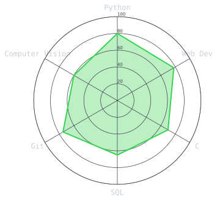
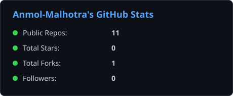
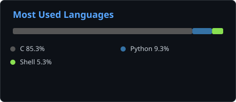

<div align="center">

<!-- PORTRAIT - generated by scripts/dotify.py from assets/portrait_source.png -->
<picture>
  <source media="(prefers-color-scheme: dark)"  srcset="assets/portrait-dark.svg">
  <source media="(prefers-color-scheme: light)" srcset="assets/portrait-light.svg">
  
</picture>

<br>

<!-- NAME / TAGLINE - animated typing -->
<a href="https://github.com/Anmol-Malhotra">
  
</a>

<br>

<!-- SOCIALS -->
<a href="https://linkedin.com/in/anmol-malhotra-a79471379"></a>
<a href="mailto:anmolmalhotra267@gmail.com"></a>
<a href="https://x.com/m_anmol02"></a>
<a href="#"></a>
<a href="https://instagram.com/anmolmalhotra_07"></a>
<a href="https://facebook.com/manmol07"></a>


</div>

---

## `~/` whoami

```console
$ cat about.txt
```

Hi, I'm **Anmol Malhotra**. I'm a first-year BTech CSE student who builds things at the intersection of
full-stack web development, computer vision, and practical tools people can actually deploy.

- 🚀 Exploring open-source, web development, and AI/ML projects
- 🧠 Passionate about turning ideas into working code
- ✨ Always learning, building, and sharing knowledge with the community
- 📌 "Code. Create. Contribute."

<br>

<div align="center">

## `~/` toolbox


</div>

---

<div align="center">

## `~/` skill radar

<!-- Self-rated radar - edit assets/skills.json, the workflow redraws it -->
<picture>
  <source media="(prefers-color-scheme: dark)"  srcset="assets/radar-dark.svg">
  <source media="(prefers-color-scheme: light)" srcset="assets/radar-light.svg">
  
</picture>

</div>

---

<div align="center">

## `~/` the numbers

<!-- Self-hosted by scripts/cards.py -- pulls live data from the GitHub API
     and renders these as static SVGs, so the section can't be taken down
     by someone else's Vercel deployment going to sleep or hitting a quota. -->
<picture>
  <source media="(prefers-color-scheme: dark)"  srcset="assets/card-github-stats-dark.svg">
  <source media="(prefers-color-scheme: light)" srcset="assets/card-github-stats-light.svg">
  
</picture>

<br><br>

<picture>
  <source media="(prefers-color-scheme: dark)"  srcset="assets/card-github-langs-dark.svg">
  <source media="(prefers-color-scheme: light)" srcset="assets/card-github-langs-light.svg">
  
</picture>

</div>

---

### ✍️ Random Dev Quote

<div align="center">


</div>

---

<div align="center">

<sub>`01100011 01101111 01100100 01100101 00100000 01100011 01110010 01100101 01100001 01110100 01100101 00100000 01100011 01101111 01101110 01110100 01110010 01101001 01100010 01110101 01110100 01100101`</sub>

</div>

<!-- Proudly created with GPRM ( https://gprm.itsvg.in ) -->
